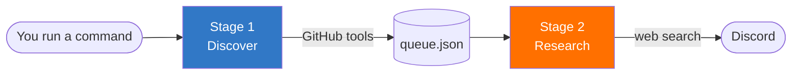

# GitHub Triage Agent


[](https://github.com/osazuwamatthewogbebor/repo-triage-app/actions/workflows/ci.yml)


An AI agent that finds open-source issues worth fixing, researches them, and posts an
implementation plan to Discord.

Give it a topic, such as `topic:express language:typescript`, and it:

1. **Finds** real open issues in active repos, using live GitHub search
2. **Queues** them, so the same issue is never handled twice
3. **Researches** each one with web search, plus the project's own contributing docs
4. **Posts** a step-by-step plan to Discord

It's a command-line tool, not a server. You run it, it works through the queue, it exits.

---

## How it works



**Stage 1: Discover.** An LLM agent searches GitHub for repos matching your topic, then
looks for open issues labelled things like `help wanted` or `good first issue`. It has
four real GitHub tools to do this, so what it finds is grounded in live data rather than
made up. It also fetches each repo's `CONTRIBUTING.md` (or `README.md` if that's missing)
so the project's own conventions travel with the issue.

The agent hands back a JSON list of issues. Each one is validated against a Zod schema,
checked against what's already queued or done, and then added to `queue.json`.

**Stage 2: Research.** The agent takes one issue off the queue. That queue item already
carries the issue body, the labels, and the repo docs that Stage 1 collected. The agent
searches the web for how other projects solve that class of problem, compares what it
finds against the project's own standards, and writes a plan: what the problem is, the
recommended approach, and the steps to implement it. That plan goes to your Discord
webhook.

The queue is what connects the two stages. Stage 1 can run many times and build up a
backlog; Stage 2 drains it one issue at a time.

---

## Quick start

**You need:** Node.js 22 or newer, and at least one LLM API key (Mistral or OpenRouter).

```bash
# 1. Install
npm install

# 2. Configure: copy the template and fill in your keys
cp .env.example .env

# 3. Check the queue (makes no API calls)
npm run dev -- status

# 4. Find some issues
npm run dev -- discover "topic:express language:typescript"

# 5. Research the next one and post to Discord
npm run dev -- process
```

> **Note the `--`.** It tells npm to pass the rest of the line to the script. Without it,
> npm swallows your arguments and the tool sees none.

To do everything in one go:

```bash
npm run dev -- run-all "topic:cli language:typescript"
```

---

## Commands

| Command | What it does |
|---|---|
| `npm run dev -- status` | List everything waiting in the queue. No API calls, no cost. |
| `npm run dev -- discover "<query>"` | Stage 1. Find issues and add them to the queue. |
| `npm run dev -- process` | Stage 2. Take **one** issue off the queue, research it, post to Discord. |
| `npm run dev -- run-all "<query>"` | Stage 1, then Stage 2 repeatedly until the queue is empty. |

The `<query>` is a normal GitHub search string, so anything you'd type into GitHub's
search box works: `topic:react language:typescript`, `label:"good first issue"`, and so on.

`run-all` is the only command that stops on error. If a stage fails on every provider, it
exits with a non-zero code rather than carrying on with a half-finished queue.

**Running from a build instead of source:**

```bash
npm run build          # compiles TypeScript into dist/
node dist/index.js status
```

---

## Configuration

All settings live in `.env`. Only the LLM key is required. Everything else has a sensible
fallback.

| Variable | Required | Default | Notes |
|---|---|---|---|
| `MISTRAL_API_KEY` | one of these two | None | Get one at console.mistral.ai |
| `OPENROUTER_API_KEY` | one of these two | None | Get one at openrouter.ai/keys |
| `LLM_PROVIDER_ORDER` | no | `mistral,openrouter` | Which provider to try first. See below. |
| `LLM_MAX_TOKENS` | no | `2000` | Caps reply length, which also caps cost. |
| `MISTRAL_MODEL` | no | `mistral-small-latest` | |
| `OPENROUTER_MODEL` | no | `openrouter/free` | |
| `GITHUB_TOKEN` | no | None | See "GitHub access" below. |
| `GITHUB_CLIENT_ID` | no | None | Only needed for the login-code flow. |
| `DISCORD_WEBHOOK_URL` | no | None | If unset, plans print to your terminal instead. |
| `SEARCH_API_KEY` | no | None | Tavily or Brave. If unset, search returns placeholder text. |
| `SEARCH_API_ENDPOINT` | no | None | e.g. `https://api.tavily.com/search` |

### Two providers, with automatic failover

The agent talks to Mistral and OpenRouter through the same API format, so either can do
the job. You list them in the order you want them tried:

```
LLM_PROVIDER_ORDER=mistral,openrouter
```

If the first provider fails (rate limit, no credit, network error) or comes back with
nothing useful, the agent automatically tries the next one. You'll see it happen in the
output:

```
[Failover] mistral failed: 429 Rate limit exceeded
```

A provider counts as failed if the request errors, or if it answers with unparseable
JSON, an empty list, or blank text. So a model that technically responds but gives you
nothing usable still hands over to the next provider.

Because `openrouter/free` routes to whichever free model is available, quality varies
between runs. If you hit repeated failures, having both providers configured is what
keeps the pipeline moving.

### GitHub access

The agent reads public GitHub data, which mostly works without logging in. But
unauthenticated requests are rate-limited hard, so you'll want one of these:

- **`GITHUB_TOKEN`**: a personal access token. Simplest option. Add it to `.env`.
- **`GITHUB_CLIENT_ID`**: if no token is set, the agent starts a device login. It prints
  a short code and a URL; you open the URL in your browser, type the code, and you're in.
  The token is saved to `~/.config/github-triage-agent/credentials.json` and reused.

If neither is set, it falls back to unauthenticated requests and tells you so.

---

## Project structure

```
src/
├── index.ts              CLI entry point: parses the command and dispatches
├── config.ts             Reads .env into one typed CONFIG object
├── auth.ts               GitHub login (device flow, with token caching)
├── queue.ts              The queue: add, pop, and track processed issues
│
├── core/
│   ├── agent.ts          The agent loop: calls the model, runs tools, repeats
│   └── providers.ts      Mistral + OpenRouter setup, and the failover logic
│
├── agents/
│   ├── github-agent.ts   Stage 1: find issues
│   └── research-agent.ts Stage 2: research one issue
│
├── tools/
│   ├── definitions.ts    The tool descriptions the model reads
│   ├── github.ts         search_repos, list_open_issues, search_issues, get_repo_file
│   ├── search.ts         search_web
│   ├── registry.ts       Maps tool names to the functions that run them
│   └── validation.ts     Zod schemas: every tool argument and model reply is checked
│
└── notifications/
    └── discord.ts        Builds and sends the Discord message
```

**How the agent loop works**, in one paragraph: the model is given a prompt and a list of
tools. It either asks to call a tool or gives a final answer. If it calls a tool, the
result is fed back and it goes again. If it answers, the loop ends. There's a turn limit
(`maxTurns` in `config.ts`) and running out of turns is treated as a failure, so a
confused model can't loop forever or post a half-finished answer.

Every tool argument is validated with Zod before it runs, and anything invalid is handed
back to the model as readable text instead of crashing the loop. That way the model gets
a chance to correct itself.

**Files it creates at runtime:** `queue.json` holds issues waiting to be researched, and
`processed.json` remembers what's already been done. Both are written to wherever you run
the command from, and both are gitignored. Delete them to start fresh.

---

## Troubleshooting

**`402` from OpenRouter**: your balance can't cover the request. The agent sends
`max_tokens` to keep the reservation small, but a free model or a few dollars of credit
is the real fix. Set `OPENROUTER_MODEL` to a `:free` slug.

**`429` from Mistral**: you're over the rate limit for your plan. Either wait, or put
OpenRouter first: `LLM_PROVIDER_ORDER=openrouter,mistral`.

**`Agent loop exhausted N turns`**: the model kept calling tools without reaching an
answer. Usually a weaker model. Raise `maxTurns` in `src/config.ts`, or switch to a
stronger model.

**Nothing posted to Discord**: check `DISCORD_WEBHOOK_URL`. When it's empty the agent
runs in dry-run mode and prints the plan to your terminal instead, which is handy for
testing.

**Same issue handled twice**: check that `queue.json` and `processed.json` are still
there. They're the only memory the tool has; without them it starts from scratch.

---

## Tech

TypeScript in strict mode (with `exactOptionalPropertyTypes` and `noUncheckedIndexedAccess`) ·
Node 22 · the `openai` SDK pointed at two providers · Zod for validating every tool call
and model reply · a GitHub Actions workflow that typechecks, builds, and smoke tests the
compiled CLI on every push. No frameworks, no build step beyond `tsc`.
